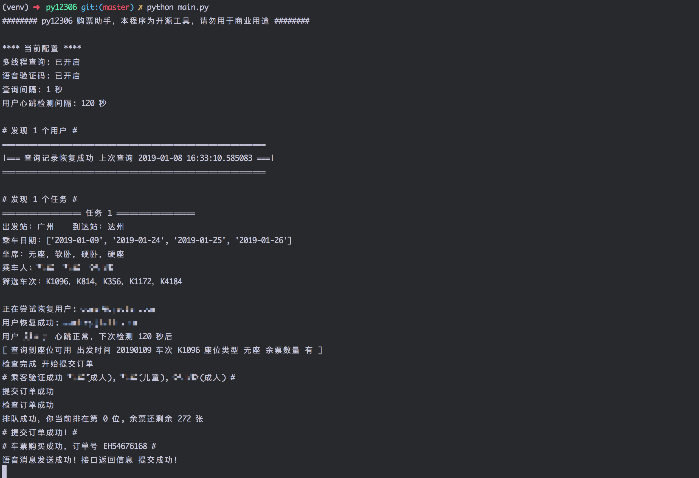

# 🚂 py12306 购票助手
分布式，多账号，多任务购票

## 前言
今年回家的票明显要难买很多，早早就答应了父母今年的票没问题，到现在一张票没买到，虽然家里已经订了汽车票，让我不用操心，但是想想他们一行还有小孩，心还是很伤的。
这段时间从 12306Bypass 到 testerSunshine 大佬写的 [12306](https://github.com/testerSunshine/12306)，还是没抢到票，索性就自己写了一个，希望也能帮助到更多人

## Features
- [x] 多日期查询余票
- [x] 自动打码下单
- [x] 用户状态恢复
- [x] 电话语音通知
- [x] 多账号、多任务、多线程支持
- [x] 单个任务多站点查询 
- [x] 分布式运行
- [ ] Docker 支持 
- [ ] 邮件通知
- [ ] Web 管理页面

## 使用
py12306 需要运行在 python 3.6 以上版本（其它版本暂未测试)

**1. 安装依赖**
```bash
git clone https://github.com/pjialin/py12306

pip install -r requirements.txt
```

**2. 配置程序**
```bash
cp env.py.example env.py
```
自动打码

打码依赖于若快平台，需要先到 [http://www.ruokuai.com](http://www.ruokuai.com/login) 注册一个账号后填写到配置中

语音通知

语音验证码使用的是阿里云 API 市场上的一个服务商，需要到 [https://market.aliyun.com/products/57126001/cmapi019902.html](https://market.aliyun.com/products/57126001/cmapi019902.html) 购买后将 appcode 填写到配置中

**3. 启动前测试**

目前提供了一些简单的测试，包括用户账号检测，乘客信息检测，车站检测等

开始测试 -t 
```bash
python main.py -t
```

测试语音通知 -t -n
```bash
# 默认不会进行通知测试，要对通知进行测试需要加上 -n 参数 
python main.py -t -n
```

**4. 运行程序**
```bash
python main.py
```

### 参数列表

- -t 测试配置信息
- -t -n 测试配置信息以及通知消息
- -c 指定自定义配置文件位置

### 分布式集群

集群依赖于 redis，目前支持情况
- 单台主节点多个子节点同时运行
- 主节点宕机后自动切换提升子节点为主节点
- 主节点恢复后自动恢复为真实主节点
- 配置通过主节点同步到所有子节点
- 主节点配置修改后无需重启子节点，支持自动更新
- 子节点消息实时同步到主节点

**使用**

将配置文件的中 `CLUSTER_ENABLED` 打开即开启分布式

目前提供了一个单独的子节点配置文件 `env.slave.py.example` 将文件修改为 `env.slave.py`， 通过 `python main -c env.slave.py` 即可快速启动

## 更新
### 19-01-10
* 支持分布式集群

## 下单成功截图


## Thanks
感谢大佬 [testerSunshine](https://github.com/testerSunshine/12306)，借鉴了部分实现

## License

[Apache License.](https://github.com/pjialin/py12306/blob/master/LICENSE)